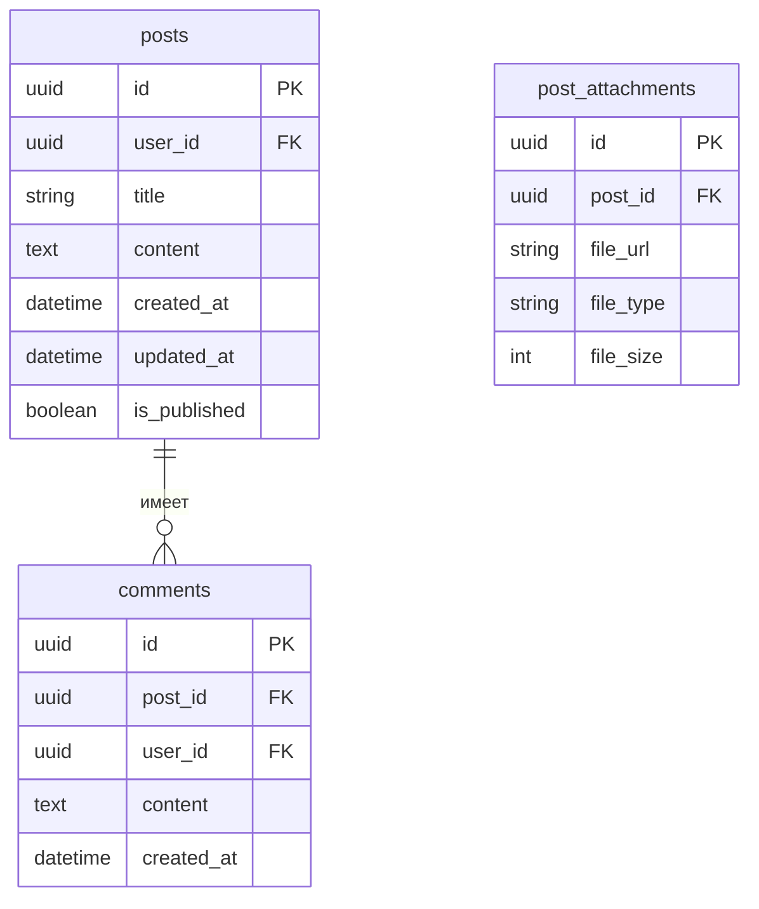

# ER-диаграммы сервисов

## User Service (PostgreSQL)
```mermaid
erDiagram
    users ||--o{ user_roles : "имеет"
    users {
        uuid id PK
        string username "Уникальный логин"
        string email
        string password_hash
        datetime created_at
        datetime updated_at
        boolean is_active
    }
    roles {
        uuid id PK
        string name "Название роли"
        string description
        datetime created_at  // ДОБАВЛЕНО
        boolean is_default   // ДОБАВЛЕНО
    }
    user_roles {
        uuid user_id FK
        uuid role_id FK
        datetime assigned_at
    }
```

## Post Service (PostgreSQL)


## Stats Service (ClickHouse)
```mermaid
erDiagram
    post_stats {
        uuid post_id PK
        int views "Количество просмотров"
        int likes "Количество лайков"
        int comments_count
        datetime first_view
        datetime last_view
    }
    user_activity {
        uuid user_id PK
        date activity_date PK
        int posts_created
        int comments_added
        int likes_given
    }
    popular_posts {
        date ranking_date PK
        int position PK
        uuid post_id
        int score
        float trend_score  // ДОБАВЛЕНО
    }
```
